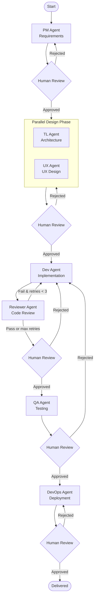

# Agent Team — AI Multi-Agent IT Delivery System

> Seven specialized AI agents collaborate to deliver software end-to-end, with a human review gate at every phase.

[](https://python.org)
[](https://fastapi.tiangolo.com)
[](https://langchain-ai.github.io/langgraph/)
[](https://react.dev)
[](https://docs.docker.com/compose/)

---

## Overview

**Agent Team** is an AI-powered software delivery system that maps the complete SDLC — from requirements to production — across seven specialized agents. Each phase pauses for human approval before the next agent picks up the work. Rejections automatically route back to the responsible agent for rework.

| Agent | Responsibility |
|---|---|
| **PM Agent** | Requirements analysis, user story decomposition, acceptance criteria |
| **Tech Lead Agent** | System architecture, technology selection, API design |
| **UX Designer Agent** | Interaction design, prototypes, component planning |
| **Dev Agent** | Code implementation, unit tests, self-validation |
| **Code Reviewer Agent** | Code quality, security scanning, improvement suggestions |
| **QA Engineer Agent** | Test case design, functional acceptance, defect reporting |
| **DevOps Agent** | Containerization, CI/CD pipeline, production deployment |

---

## Workflow



Three workflow templates are available:

| Template | Description |
|---|---|
| `full` | All 7 agents, TL + UX run in parallel, Reviewer auto-reworks up to 3 times |
| `fast` | Skips UX and QA for rapid delivery |
| `review_only` | PM → Dev → Reviewer only |

---

## Tech Stack

**Backend**
- [FastAPI](https://fastapi.tiangolo.com) — REST API framework
- [LangGraph](https://langchain-ai.github.io/langgraph/) — stateful agent workflow graph
- [Anthropic Claude](https://anthropic.com) — underlying LLM (proxy-compatible)
- PostgreSQL — task persistence
- Redis — LangGraph checkpoint store

**Frontend**
- React 18 + TypeScript + Vite
- React Router — multi-page navigation
- Mermaid — workflow visualization

**Infrastructure**
- Docker + Docker Compose — one-command startup
- GitLab integration — auto-creates Issues, MRs, and pushes generated code

---

## Getting Started

### Prerequisites

- Docker & Docker Compose
- An Anthropic API key (or a compatible proxy)

### 1. Clone and configure

```bash
git clone https://github.com/mingkai2015/agent-team.git
cd agent-team

cp .env.example .env
# Edit .env and fill in your API key and settings
```

### 2. Start all services

```bash
docker compose up -d
```

Once running:
- **Web UI** → http://localhost:8000
- **API docs** → http://localhost:8000/docs

### 3. Local development (without Docker)

```bash
python -m venv .venv
source .venv/bin/activate
pip install -r requirements.txt

# Requires PostgreSQL and Redis running locally
uvicorn app.main:app --reload
```

---

## Configuration

All settings are loaded from `.env` (see `.env.example` for the full template):

```ini
# Anthropic LLM
ANTHROPIC_BASE_URL=https://api.anthropic.com
ANTHROPIC_AUTH_TOKEN=sk-ant-...
ANTHROPIC_MODEL=claude-sonnet-4-5-20250929

# GitLab integration
# Set GITLAB_MODE=mock to run without a real GitLab instance
GITLAB_MODE=mock        # mock | real
GITLAB_URL=https://gitlab.com
GITLAB_TOKEN=glpat-...
GITLAB_PROJECT_ID=your-namespace/your-project
```

---

## API Reference

| Method | Path | Description |
|---|---|---|
| `POST` | `/requirements` | Submit a requirement; triggers PM Agent analysis |
| `GET` | `/tasks` | List all tasks |
| `GET` | `/tasks/{id}` | Get task details |
| `POST` | `/tasks/{id}/approve` | Submit a review decision (`approve` / `reject`) |
| `GET` | `/tasks/{id}/spec` | Get the requirements spec |
| `GET` | `/tasks/{id}/architecture` | Get the architecture design |
| `GET` | `/tasks/{id}/implementation` | Get generated code |
| `GET` | `/tasks/{id}/review` | Get the code review report |
| `GET` | `/tasks/{id}/test-report` | Get the QA test report |
| `GET` | `/tasks/{id}/deployment` | Get the deployment configuration |
| `GET` | `/observability/metrics` | Observability metrics |
| `GET` | `/evaluation` | Task score summary |
| `GET` | `/skills` | Agent skill registry |

Full interactive docs available at `http://localhost:8000/docs`.

---

## Project Structure

```
agent-team/
├── app/
│   ├── agents/              # Seven specialized agent implementations
│   │   ├── llm_client.py    # Shared LLM client with retry & backoff
│   │   ├── pm_agent.py
│   │   ├── tl_agent.py
│   │   ├── ux_agent.py
│   │   ├── dev_agent.py
│   │   ├── reviewer_agent.py
│   │   ├── qa_agent.py
│   │   └── devops_agent.py
│   ├── workflow/            # LangGraph state machine
│   │   ├── graph.py         # Graph definition and workflow templates
│   │   ├── nodes.py         # Per-phase node functions
│   │   └── state.py         # WorkflowState TypedDict
│   ├── main.py              # FastAPI routes
│   ├── models.py            # Data models
│   ├── database.py          # PostgreSQL persistence
│   ├── observability.py     # Tracing and metrics
│   ├── evaluation.py        # Task scoring
│   └── auth.py              # API key authentication middleware
├── frontend/                # React + TypeScript + Vite
│   └── src/pages/
│       ├── Dashboard.tsx
│       ├── WorkflowGraph.tsx
│       ├── ProjectDetail.tsx
│       └── TaskDetail.tsx
├── tests/                   # pytest test suite
├── docker-compose.yaml
├── Dockerfile
└── .env.example
```

---

## License

MIT
