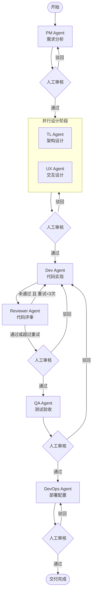

# Agent Team — AI Multi-Agent IT Delivery System

> 由 7 个专属 AI 智能体协作完成软件交付全流程，每个阶段设置人工审核门禁。

[](https://python.org)
[](https://fastapi.tiangolo.com)
[](https://langchain-ai.github.io/langgraph/)
[](https://react.dev)
[](https://docs.docker.com/compose/)

---

## 概览

**Agent Team** 是一套 AI 驱动的软件交付系统，将从需求分析到生产部署的完整 SDLC 流程分配给 7 个专属 AI 智能体：

| 智能体 | 职责 |
|---|---|
| **PM Agent** | 需求分析、用户故事拆解、验收标准制定 |
| **Tech Lead Agent** | 系统架构设计、技术选型、API 设计 |
| **UX Designer Agent** | 交互设计、原型方案、组件规划 |
| **Dev Agent** | 代码实现、单元测试、自检验证 |
| **Code Reviewer Agent** | 代码质量审查、安全扫描、改进建议 |
| **QA Engineer Agent** | 测试用例设计、功能验收、缺陷报告 |
| **DevOps Agent** | 容器化配置、CI/CD、生产环境部署方案 |

每个阶段完成后都会暂停，等待人工审核（通过 / 驳回）。驳回时自动回退到对应智能体重新执行。

---

## 工作流



支持三种工作流模板：

| 模板 | 说明 |
|---|---|
| `full` | 全量流程，TL+UX 并行设计，Reviewer 自动重试（最多 3 次） |
| `fast` | 跳过 UX 和 QA，快速交付 |
| `review_only` | 仅 PM + Dev + Reviewer |

---

## 技术栈

**后端**
- [FastAPI](https://fastapi.tiangolo.com) — REST API 框架
- [LangGraph](https://langchain-ai.github.io/langgraph/) — 智能体工作流状态机
- [Anthropic Claude](https://anthropic.com) — 底层 LLM（支持代理配置）
- PostgreSQL — 任务持久化
- Redis — LangGraph checkpoint 存储

**前端**
- React 18 + TypeScript + Vite
- React Router — 多页面路由
- Mermaid — 工作流可视化

**DevOps**
- Docker + Docker Compose 一键启动
- GitLab 集成 — 自动创建 Issue / MR / 推送代码

---

## 快速开始

### 前置条件

- Docker & Docker Compose
- Anthropic API Key（或兼容代理）

### 1. 克隆并配置

```bash
git clone https://github.com/mingkai2015/agent-team.git
cd agent-team

cp .env.example .env
# 编辑 .env，填入你的 API Key 和配置
```

### 2. 启动服务

```bash
docker compose up -d
```

服务启动后访问：
- **前端**：http://localhost:8000
- **API 文档**：http://localhost:8000/docs

### 3. 本地开发（不使用 Docker）

```bash
python -m venv .venv
source .venv/bin/activate
pip install -r requirements.txt

# 需要本地运行 PostgreSQL 和 Redis
uvicorn app.main:app --reload
```

---

## 配置说明

`.env` 中的关键配置项（参考 `.env.example`）：

```ini
# Anthropic LLM
ANTHROPIC_BASE_URL=https://api.anthropic.com
ANTHROPIC_AUTH_TOKEN=sk-ant-...
ANTHROPIC_MODEL=claude-sonnet-4-5-20250929

# GitLab 集成（设置为 mock 可在不连接 GitLab 的情况下运行）
GITLAB_MODE=mock   # mock | real
GITLAB_URL=https://gitlab.com
GITLAB_TOKEN=glpat-...
GITLAB_PROJECT_ID=your-namespace/your-project
```

---

## API 参考

| 方法 | 路径 | 说明 |
|---|---|---|
| `POST` | `/requirements` | 提交新需求，触发 PM Agent 分析 |
| `GET` | `/tasks` | 获取所有任务列表 |
| `GET` | `/tasks/{id}` | 获取单个任务详情 |
| `POST` | `/tasks/{id}/approve` | 提交审核决定（approve / reject） |
| `GET` | `/tasks/{id}/spec` | 获取需求规格 |
| `GET` | `/tasks/{id}/architecture` | 获取架构设计 |
| `GET` | `/tasks/{id}/implementation` | 获取实现代码 |
| `GET` | `/tasks/{id}/review` | 获取代码评审报告 |
| `GET` | `/tasks/{id}/test-report` | 获取测试报告 |
| `GET` | `/tasks/{id}/deployment` | 获取部署配置 |
| `GET` | `/observability/metrics` | 获取可观测性指标 |
| `GET` | `/evaluation` | 获取任务评分汇总 |
| `GET` | `/skills` | 获取所有智能体技能清单 |

完整交互式文档：`http://localhost:8000/docs`

---

## 项目结构

```
agent-team/
├── app/
│   ├── agents/          # 7 个专属智能体实现
│   │   ├── llm_client.py    # 共享 LLM 客户端（含重试机制）
│   │   ├── pm_agent.py
│   │   ├── tl_agent.py
│   │   ├── ux_agent.py
│   │   ├── dev_agent.py
│   │   ├── reviewer_agent.py
│   │   ├── qa_agent.py
│   │   └── devops_agent.py
│   ├── workflow/        # LangGraph 状态机
│   │   ├── graph.py         # 图结构定义与模板
│   │   ├── nodes.py         # 各阶段节点函数
│   │   └── state.py         # WorkflowState TypedDict
│   ├── main.py          # FastAPI 路由
│   ├── models.py        # 数据模型
│   ├── database.py      # PostgreSQL 持久化
│   ├── observability.py # 追踪与指标
│   ├── evaluation.py    # 任务评分
│   └── auth.py          # API Key 认证中间件
├── frontend/            # React + TypeScript + Vite
│   └── src/pages/
│       ├── Dashboard.tsx
│       ├── WorkflowGraph.tsx
│       ├── ProjectDetail.tsx
│       └── TaskDetail.tsx
├── tests/               # pytest 测试套件
├── docker-compose.yaml
├── Dockerfile
└── .env.example
```

---

## License

MIT
